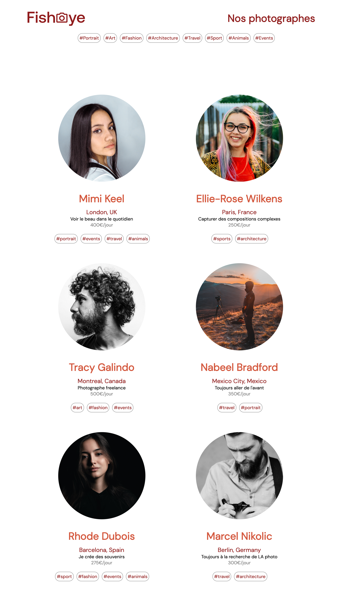
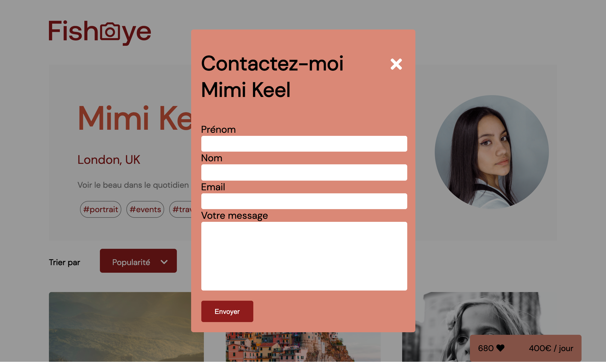
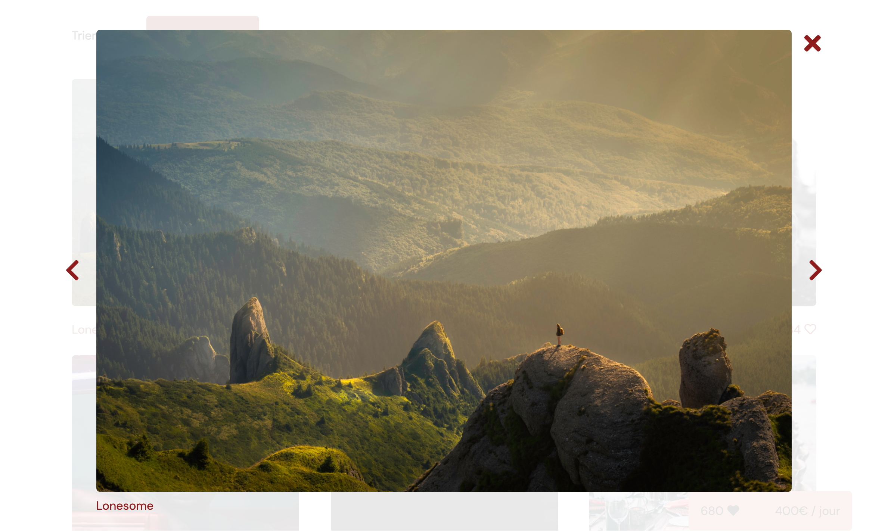

  

# GameOn

## Description

Projet 6 du parcours développeur Front-end chez Openclassrooms qui a pour objectif de construire un prototype fonctionnel d'un site de photographes en freelance pour montrer leurs photos et pouvoir les contacter via un formulaire de message. La priorité absolue du site est l'accessibilité.

## Lien du projet

[Site Web GameOn](https://devnicolay.github.io/LauraNicolay_6_10082021/)

## Maquette de la page d'accueil

## Maquette de la page photographe

## Maquette de la modale du formulaire

## Maquette de la lightbox des médias

## Éléments fournis par l’entreprise virtuelle

- La maquette de la page d’accueil, de la page des photographes individuellement, de la modale formulaire et de la lightbox des médias [Maquettes](https://www.figma.com/file/Q3yNeD7WTK9QHDldg9vaRl/UI-Design-FishEye-FR?node-id=0%3A1)
- La note de réunion détaillant les principales fonctionnalités et les exigences techniques à mettre en œuvre. [Note de réunion](https://github.com/Devnicolay/LauraNicolay_6_10082021/tree/master/images)
- Les photos et vidéos des photographes
- Les données des photographes au format Json

## Cahier des charges

- Le développement devra se faire en HTML, CSS, et JavaScript Pur (Pas de jQuery)
- Il faudra utiliser des fichiers séparés pour le HTML, CSS et le Javascript
- Le code devra être commenter (les fonctions et les parties du code qui nécessitent plus de détails)
- La programmation orientée objet (POO) sera utilisée.
- Utilisation de EsLint
- construire le site conformément aux exigences d'accessibilité (par ex. utiliser les balises ARIA, assurer la navigation au clavier, site compatible avec les lecteurs d'écran)
- Le site devra être passé au vérificateur d’accessibilité comme AChecker
- Lorsque l'utilisateur clique sur l'icône "Like" d'un média, le nombre de likes affiché est incrémenté et mis à jour au compteur total de likes
- Les médias peuvent être triés par popularité ou par titre
- Lorsque l'utilisateur clique sur un média, celui-ci doit s’ouvrir dans une lightbox

## Outils utilisés

- Visual Studio Code avec les plugins Live server
- EsLint
- Git
- GitHub pour le versionning
- Heberger le site sur GitHub Pages
